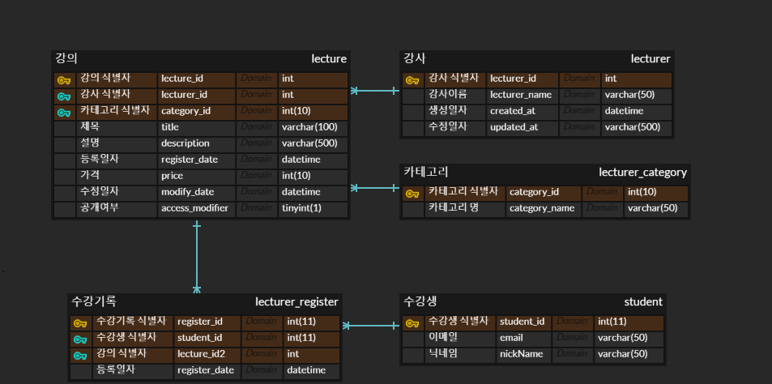

# 데이터 베이스 ER 다이어그램


# Lecture Table Schema
- 역할 : 강의 정보를 보관하는 테이블
- 관계 : 강사 1 : 강의 M 관계
  
## 초기 테이블: lecture

| 컬럼             | 타입          | 속성                                                       |
|-----------------|---------------|-----------------------------------------------------------|
| lecture_id      | int           | Auto Increment, Primary Key                               |
| category        | int(4)        | Nullable                                                  |
| title           | varchar(50)   | Nullable                                                  |
| register_date   | datetime      | Nullable                                                  |
| lecturer_id     | int           | Nullable                                                  |
| price           | int(6)        | Nullable                                                  |
| modify_date     | datetime      | Nullable                                                  |
| access_modifier | int(1)        | Nullable                                                  |

## 제약조건

| 제약 조건 유형    | 컬럼(s)         | 참조                                       |
|-----------------|----------------|--------------------------------------------|
| Primary Key     | lecture_id     |                                            |
| Foreign Key     | lecturer_id    | references `lecturer(lecturer_id)`         |
| Foreign Key     | category       | references `lecturer_category(category_id)`|


## 문제사항
* access_modifier 필드 int(1)로 설정되어있으며 이는 0에서 부터 9까지의 값만 허용한다는 것을 의미한다.
이 필드가 이진 값 0, 1을 의미하는 것이므로 TINYINT(1)으로 설정하는 것이 적합한다고 판단하여 변경

* null 허용 여부 체크하지 않는 문제

* register_date와 modify_date는 일반적으로 자동으로 현재 시간을 입력하는 것이 좋습니다. 
이를 위해 DEFAULT CURRENT_TIMESTAMP와 ON UPDATE CURRENT_TIMESTAMP와 같은 설정을 추가할 수 있습니다.

## 최종 테이블: lecture

| 컬럼             | 타입              | 속성                                             |
|-----------------|-------------------|-------------------------------------------------|
| lecture_id      | int(4)            | Auto Increment, Primary Key                     |
| category        | int(4)            | Not Null                                        |
| title           | varchar(50)       | Not Null                                        |
| description     | varchar(100)      | Not Null                                        |
| register_date   | datetime          | Default: current_timestamp(), Nullable          |
| lecturer_id     | int(4)            | Not Null                                        |
| price           | int(4)            | Not Null                                        |
| modify_date     | datetime          | Default: current_timestamp(), Not Null, On Update: current_timestamp() |
| access_modifier | tinyint(1)        | Default: 0, Not Null                            |

## 제약조건

| 제약 조건 유형    | 컬럼(s)             | 참조                                       |
|-----------------|--------------------|--------------------------------------------|
| Primary Key     | lecture_id         |                                            |
| Foreign Key     | lecturer_id        | references `lecturer(lecturer_id)`         |
| Foreign Key     | category           | references `lecturer_category(category_id)`|

## 인덱스

| 인덱스 명칭            | 컬럼(s)                    |
|-----------------------|---------------------------|
| idx_category_lecturer | category, lecturer_id     |
| idx_lecture_category  | category                  |
| idx_lecture_lecturer_id | lecturer_id             |
| idx_title             | title                     |


# Lecturer Table Schema
- 역할 : 강사 정보를 보관하는 테이블
- 관계 : 강사 1 : 강의 M 관계
  
## 초기 테이블: lecturer

| 컬럼           | 타입          | 속성                         |
|---------------|---------------|-----------------------------|
| lecturer_id   | int(4)        | Auto Increment, Primary Key |
| lecturer_name | varchar(50)   | Not Null                    |

## 제약조건

| 제약 조건 유형    | 컬럼(s)         | 참조       |
|-----------------|----------------|-----------|
| Primary Key     | lecturer_id    |           |

## 문제사항
* 타임스탬프 필드 추가 : create_at, update_at 필드를 추가하여 강사 정보가 생성되고 마지막으로 업데이트된 시간을 기록할 수 있습니다.
이를 통해 변경 이력을 추적할 수 있습니다.

* 인덱스 추가 : 검색 성능을 높이기 위해 적절한 인덱스를 추가할 수 있습니다. 
예를 들어, lecturer_name 필드에 인덱스를 추가하면 이름으로 강사를 검색할 떄 성능이 향상될 수 있습니다.

## 최종 테이블: lecturer

| 컬럼           | 타입          | 속성                                                       |
|---------------|---------------|-----------------------------------------------------------|
| lecturer_id   | int(4)        | Auto Increment, Primary Key                               |
| lecturer_name | varchar(50)   | Not Null                                                  |
| created_at    | datetime      | Default: current_timestamp(), Nullable                    |
| updated_at    | datetime      | Default: current_timestamp(), On Update: current_timestamp(), Nullable |

## 제약조건

| 제약 조건 유형    | 컬럼(s)         | 참조       |
|-----------------|----------------|-----------|
| Primary Key     | lecturer_id    |           |

## 인덱스

| 인덱스 명칭        | 컬럼(s)         |
|-------------------|----------------|
| idx_lecturer_name | lecturer_name  |


# lecturer_category Table Schema
- 역할 : 강의 항목을 저장하는 테이블 string값을 int값으로 매칭하는 맵핑 테이블
- 관계 : 카테고리 1 : 강의 M 관계

## 초기 테이블: lecturer_category

| 컬럼           | 타입          | 속성                         |
|---------------|---------------|-----------------------------|
| category_id   | int(4)        | Auto Increment, Primary Key |
| category_name | varchar(50)   | Not Null                    |

## 제약조건

| 제약 조건 유형    | 컬럼(s)      | 참조       |
|-----------------|--------------|-----------|
| Primary Key     | category_id  |           |

## 문제사항
* 유니크 제약 조건 : `category_name` 필드에 유니크 제약 조건을 추가하여 중복된 카테고리 이름이 입력되지 않도록 합니다.
카테고리 이름은 고유해야 하는 경우가 많기 때문입니다.

* 인덱스 추가 : 검색 성능을 높이기 위해 `category_name` 필드에 인덱스를 추가하여 이름으로 카테고리를 검색할 때 성능을 향상시키 필요가 있어보입니다.

## 최종 테이블: lecturer_category

| 컬럼           | 타입          | 속성                         |
|---------------|---------------|-----------------------------|
| category_id   | int(4)        | Auto Increment, Primary Key |
| category_name | varchar(50)   | Not Null, Unique            |

## 제약조건

| 제약 조건 유형    | 컬럼(s)        | 참조       |
|-----------------|----------------|-----------|
| Primary Key     | category_id    |           |
| Unique          | category_name  |           |

## 인덱스

| 인덱스 명칭         | 컬럼(s)         |
|--------------------|----------------|
| idx_category_name  | category_name  |


# Lecturer Register Table Schema
- 역할 : 수강생이 수강 신청을 진행한 내역을 보관하는 테이블
- 관계 : 수강생 1 : 수강 신청 M 관계 

## 초기 테이블: lecturer_register

| 컬럼           | 타입          | 속성                               |
|---------------|---------------|-----------------------------------|
| register_id   | int           | Auto Increment, Primary Key       |
| lecturer_id   | int           | Not Null                          |
| lecture_id    | int           | Not Null                          |
| register_date | datetime      | Default: CURRENT_TIMESTAMP        |

## 제약조건

| 제약 조건 유형    | 컬럼(s)         | 참조                               |
|-----------------|----------------|------------------------------------|
| Primary Key     | register_id    |                                    |
| Foreign Key     | lecturer_id    | references `lecturer(lecturer_id)` |
| Foreign Key     | lecture_id     | references `lecture(lecture_id)`   |

## 문제사항
컬럼 역할 및 제약 조건 오류 : student_id 학생 식별자와 lecture_id 강의 식별자 조합으로 구성되어있어야하나,
lecturer_id 강사 이름과 조합되어 들어간 문제 발생

유니크 제약 조건 : `lecturer_id` 와 `student_id` 조합에 유니크 제약 조건을 추가하여 동일한 강의를 학생이 수강하지 못하도록 방지할 수 있습니다.

인덱스 추가 : 검색 성능을 높이고자 `lecturer_id` 와 `student_id` 필드에 인덱스를 추가하여 검색 성능을 향상 시킬 수 있습니다.

## 최종 테이블: lecturer_register

| 컬럼           | 타입          | 속성                                                |
|---------------|---------------|----------------------------------------------------|
| register_id   | int(4)        | Auto Increment, Primary Key                        |
| student_id    | int(4)        | Not Null                                           |
| lecture_id    | int(4)        | Not Null                                           |
| register_date | datetime      | Default: current_timestamp(), Nullable             |

## 제약조건
 
| 제약 조건 유형       | 컬럼(s)                 | 참조                               |
|--------------------|------------------------|------------------------------------|
| Primary Key        | register_id            |                                    |
| Unique             | student_id, lecture_id |                                    |
| Foreign Key        | student_id             | references `student(student_id)`   |
| Foreign Key        | lecture_id             | references `lecture(lecture_id)`   |

## 인덱스

| 인덱스 명칭        | 컬럼(s)        |
|------------------|---------------|
| idx_lecture_id   | lecture_id    |
| idx_lecturer_id  | student_id    |


# Student Table Schema

## 초기 테이블: student

| 컬럼        | 타입          | 속성                         |
|------------|---------------|-----------------------------|
| student_id | int           | Auto Increment, Primary Key |
| email      | varchar(50)   | Not Null                    |
| nickname   | varchar(50)   | Not Null                    |

## 제약조건

| 제약 조건 유형    | 컬럼(s)    | 참조       |
|-----------------|------------|-----------|
| Primary Key     | student_id |           |

## 문제사항
유니크 제약 조건 : 'email' 'nickName' 필드에 유니크 제약 조건을 추가하여 중복된 이메일과 닉네임이 입력되지 않도록 고유 적용하였습니다.

타임스탬프 필드 추가 : `create_at` `update_at` 필드를 추가하여 학생 정보가 생성되고 마지막으로 업데이트된 시간을 기록할 수 있습니다.
이를 통해 변경 이력을 추적할 수 있습니다.

인덱스 추가 : 검색 성능을 높이기 위해 `email` `nickName 필드에 인덱스를 추가하여 검색 성능이 향상될 수 있도록 하였습니다.


## 최종 테이블: student

| 컬럼        | 타입          | 속성                         |
|------------|---------------|-----------------------------|
| student_id | int(4)        | Auto Increment, Primary Key |
| email      | varchar(50)   | Not Null, Unique            |
| nickname   | varchar(50)   | Not Null, Unique            |

## 제약조건

| 제약 조건 유형    | 컬럼(s)    | 참조       |
|-----------------|------------|-----------|
| Primary Key     | student_id |           |
| Unique          | email      |           |
| Unique          | nickname   |           |

## 인덱스

| 인덱스 명칭      | 컬럼(s)    |
|----------------|------------|
| idx_email      | email      |
| idx_nickname   | nickname   |


## VIEW 테이블

## lecture_info
int타입 식별자를 string 타입으로 맵핑하여 강의 정보를 보여주는 VIEW 테이블

## 선언문
```
create definer = root@`%` view if not exists lecture_info as
select `l`.`lecture_id`      AS `lecture_id`,
       `l`.`title`           AS `title`,
       `l`.`category`        AS `category`,
       `l`.`register_date`   AS `lecture_register_date`,
       `l2`.`lecturer_name`  AS `lecturer_name`,
       `l`.`price`           AS `price`,
       `l`.`modify_date`     AS `modify_date`,
       `l`.`access_modifier` AS `access_modifier`
from (`lecture`.`lecture` `l` left join `lecture`.`lecturer` `l2` on (`l`.`lecturer_id` = `l2`.`lecturer_id`));
```

## lecture_register_view_6nd
int타입 식별자를 string 타입으로 맵핑하여 강의 정보를 보여주는 VIEW 테이블

## 고민사항
식별자 맵핑하여 저장하다 보니 

## 선언문

**MariaDB**
```
select `l`.`lecture_id`      AS `lecture_id`,
       `l`.`title`           AS `title`,
       `l`.`category`        AS `category`,
       `l`.`register_date`   AS `lecture_register_date`,
       `l2`.`lecturer_name`  AS `lecturer_name`,
       `l`.`price`           AS `price`,
       `l`.`modify_date`     AS `modify_date`,
       `l`.`access_modifier` AS `access_modifier`,
       `lr`.`register_id`    AS `register_id`,
       `s`.`nickname`        AS `nickname`,
       count(`s`.`nickname`) AS `register_count`,
       `lr`.`register_date`  AS `register_date`
from (((`lecture`.`lecture` `l` left join `lecture`.`lecturer` `l2`
        on (`l`.`lecturer_id` = `l2`.`lecturer_id`)) left join `lecture`.`lecturer_register` `lr`
       on (`l`.`lecture_id` = `lr`.`lecture_id`)) left join `lecture`.`student` `s`
      on (`lr`.`student_id` = `s`.`student_id`))
group by `l`.`lecture_id`
order by `l`.`lecture_id`
```

**MySQL**
```
select `l`.`lecture_id`                 AS `lecture_id`,
       `l`.`title`                      AS `title`,
       `l`.`category`                   AS `category`,
       `l`.`register_date`              AS `lecture_register_date`,
       `l2`.`lecturer_name`             AS `lecturer_name`,
       `l`.`price`                      AS `price`,
       `l`.`modify_date`                AS `modify_date`,
       `l`.`access_modifier`            AS `access_modifier`,
       count(distinct `s`.`student_id`) AS `register_count`
from (((`lecture`.`lecture` `l` left join `lecture`.`lecturer` `l2`
        on ((`l`.`lecturer_id` = `l2`.`lecturer_id`))) left join `lecture`.`lecturer_register` `lr`
       on ((`l`.`lecture_id` = `lr`.`lecture_id`))) left join `lecture`.`student` `s`
      on ((`lr`.`student_id` = `s`.`student_id`)))
group by `l`.`lecture_id`, `l`.`title`, `l`.`category`, `l`.`register_date`, `l2`.`lecturer_name`, `l`.`price`,
         `l`.`modify_date`, `l`.`access_modifier`
order by `l`.`lecture_id`;
```

## lecture_registration_details
학생 int 식별자를 nickName과 맵핑하여 수강 정보를 보여주는 VIEW 테이블

## 선언문
```
select `lr`.`register_id`   AS `register_id`,
       `lr`.`student_id`    AS `student_id`,
       `s`.`nickname`       AS `nickname`,
       `lr`.`lecture_id`    AS `lecture_id`,
       `lr`.`register_date` AS `register_date`
from (`lecture`.`lecturer_register` `lr` join `lecture`.`student` `s` on (`lr`.`student_id` = `s`.`student_id`))
```

## VIEW 테이블 사용의 이점
- 퀴리 단순화 :
- 재사용성 향상 :
- 보안 강화 : 
- 유지 관리 용의 : 